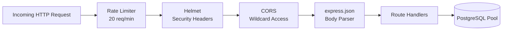
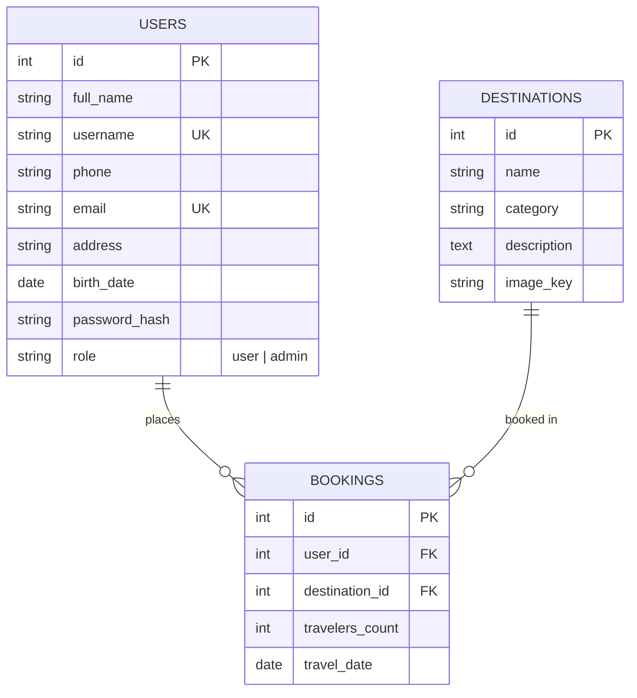
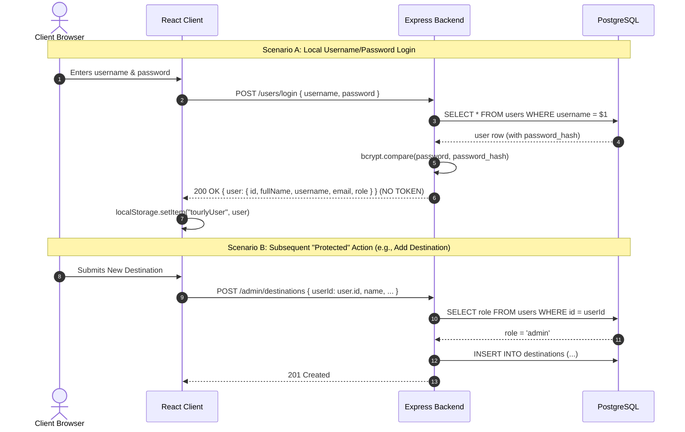
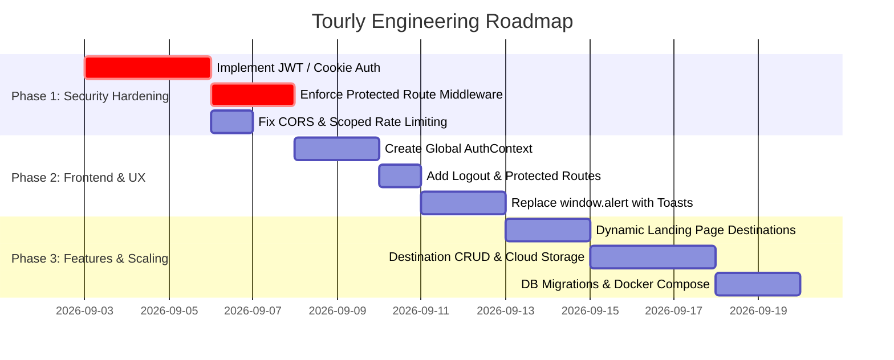

# Tourly Codebase & Security Audit Report

**Date of Audit:** September 2, 2026  
**Repository / Workspace:** `c:\Projects\INSA-weekend\Tourly`  
**Application Name:** Tourly (Travel & Destination Booking Platform)  
**Audit Scope:** Full-stack codebase examination (`src/` client, `backend/` server, database layer, configuration, authentication, and security architecture).

---

## Executive Summary

**Tourly** is a full-stack web application designed for discovering travel destinations, managing administrative destination listings, and booking customized travel itineraries. The project is split into a **React 19 / Vite** single-page application and an **Express 5 / PostgreSQL** RESTful backend.

While the foundational features (user registration, credential/Google login, destination creation, and booking workflows) are functional, the codebase exhibits critical security gaps—most notably the **absence of token-based/session-based authentication**, **unauthenticated endpoint access allowing user impersonation**, **unrestricted CORS**, and **overly restrictive global rate limiting**. This report details the tech stack, architecture, API surface, frontend patterns, security findings, and prioritized remediation roadmap.

---

## 1. Project Overview & Tech Stack

The workspace is organized as a decoupled monorepo containing two separate Node.js project roots: the client at the workspace root and the server inside `backend/`.

```
Tourly/
├── (Root: Frontend Client)
└── backend/ (Backend Server)
```

### 1.1 Technology Matrix

| Layer | Technology | Version | Purpose / Notes |
| :--- | :--- | :--- | :--- |
| **Frontend Framework** | React | `^19.2.4` | Component-based UI library |
| **Frontend DOM** | React DOM | `^19.2.4` | DOM renderer for React |
| **Build Tool / Bundler** | Vite | `^8.0.1` | Ultra-fast dev server with HMR & Rollup bundler |
| **Client Routing** | React Router DOM | `^7.14.1` | Declarative client-side routing (`BrowserRouter`) |
| **Client Auth SDK** | `@react-oauth/google` | `^0.13.5` | Google Identity Services button & OAuth flow |
| **Frontend Styling** | Vanilla CSS | Custom | Dedicated CSS per page/component + Google Fonts |
| **Linting & Quality** | ESLint | `^9.39.4` | ESLint flat config (`eslint.config.js`) |
| **Backend Runtime** | Node.js (CommonJS) | `18+ / 20+` | Server execution environment (`"type": "commonjs"`) |
| **Backend Framework** | Express | `^5.2.1` | REST API HTTP server |
| **Database Driver** | `pg` (node-postgres) | `^8.20.0` | Connection pooling via `pg.Pool` for PostgreSQL |
| **Password Hashing** | `bcryptjs` | `^3.0.3` | One-way hashing (10 salt rounds) |
| **Google Auth Verification** | `google-auth-library` | `^10.6.2` | Server-side ID Token verification (`OAuth2Client`) |
| **HTTP Security** | `helmet` | `^8.1.0` | Security headers (CSP/COEP modified) |
| **Cross-Origin Handling** | `cors` | `^2.8.6` | CORS middleware (currently wildcard) |
| **Rate Limiting** | `express-rate-limit` | `^8.3.2` | Brute-force / DoS protection middleware |
| **Input Validation** | `express-validator` | `^7.3.1` | Request schema validation & sanitization |
| **Config Management** | `dotenv` | `^17.3.1` | Environment variable loader |

---

## 2. Architecture & File Structure

### 2.1 Annotated Project Tree

```
Tourly/
├── .env                                # Frontend environment variables (VITE_API_URL, VITE_GOOGLE_CLIENT_ID)
├── .gitignore                          # Git ignore rules for node_modules, dist, .env
├── eslint.config.js                    # ESLint 9 flat configuration with React hooks plugin
├── index.html                          # HTML entry point with viewport and title metadata
├── package.json                        # Frontend dependencies, scripts (dev, build, lint, preview)
├── package-lock.json                   # Frontend locked dependency tree
├── README.md                           # Default Vite template documentation
├── vite.config.js                      # Vite config configuring @vitejs/plugin-react
│
├── backend/
│   ├── .env                            # Backend private environment configuration
│   ├── .env.example                    # Template environment variable file
│   ├── db.js                           # PostgreSQL connection pool instantiation
│   ├── package.json                    # Backend dependencies and metadata
│   ├── package-lock.json               # Backend locked dependency tree
│   ├── server.js                       # Express app entry point, routes, and middleware
│   └── validator.js                    # express-validator schemas for user signup
│
├── public/                             # Static public assets
│
└── src/
    ├── main.jsx                        # React root entry, wraps App in GoogleOAuthProvider
    ├── App.jsx                         # Main client routing configuration (Routes & Route)
    ├── App.css                         # Empty root stylesheet
    ├── index.css                       # Global base styles, background gradient, resets
    │
    ├── welcome.jsx                     # Post-login portal with navigation to booking actions
    ├── welcome.css                     # Styling for welcome view
    │
    ├── Log_in.jsx                      # Login form (local username/password + Google Login)
    ├── Log_in.css                      # Styling for login panel and Google button
    │
    ├── Sign_up.jsx                     # User registration form with multi-field inputs
    ├── Sign_up.css                     # Styling for registration panel
    │
    ├── Booking.jsx                     # Trip booking form with dynamic destination selector
    ├── booking.css                     # Styling for booking form
    │
    ├── BookingList.jsx                 # User booking history cards with date formatting
    ├── bookingList.css                 # Styling for booking list view
    │
    ├── AdminDashboard.jsx              # Admin destination creation panel with role check
    ├── adminDashboard.css              # Styling for admin dashboard
    │
    ├── components/
    │   ├── Navbar.jsx                  # Top navigation bar with logo and sign-in button
    │   ├── navbar.css                  # Navbar styles (glassmorphism / transparent header)
    │   ├── Hero.jsx                    # Hero section with headline and action button
    │   ├── hero.css                    # Hero typography and styling
    │   ├── TopSection.jsx              # Layout wrapper combining Navbar and Hero
    │   ├── topSection.css              # Hero background image container
    │   ├── ProgramsSection.jsx         # Grid showcase of destinations by geographical region
    │   └── programsSection.css         # Destination card grid layout & responsive styling
    │
    └── assets/
        ├── hero.png                    # Hero illustration asset
        ├── react.svg                   # React logo
        ├── vite.svg                    # Vite logo
        └── images/                     # Static travel destination photography
            ├── australia.jpg
            ├── china.jpg
            ├── ethiopia.jpg
            ├── germany.jpg
            ├── ghana.jpg
            ├── hero.jpg
            ├── hero_bg.jpg             # High-res hero background image
            ├── japan.jpg
            ├── southAfrica.jpg
            └── tanzania.jpg
```

---

## 3. Backend & API Layer

### 3.1 Middleware Pipeline

The Express pipeline in `backend/server.js` processes requests in the following sequence:



1. **`express-rate-limit`**: Configured with `windowMs: 1 * 60 * 1000` (1 minute) and `max: 20` requests per IP address.
2. **`helmet`**: Configured with `{ contentSecurityPolicy: false, crossOriginEmbedderPolicy: false }`.
3. **`cors()`**: Permissive wildcard enabling all origins and headers (`app.use(cors())`). (Note: previous origin-restricted CORS block is commented out on lines 27–31).
4. **`express.json()`**: Standard JSON payload parsing middleware.

---

### 3.2 Endpoint Specification & Route Matrix

| Method | Path | Auth / Validation | Request Body / Query Params | Expected Responses | Description |
| :--- | :--- | :--- | :--- | :--- | :--- |
| `GET` | `/` | None | None | **200 OK**: `"Auth server is running"` | Health / status ping endpoint. |
| `POST` | `/users/signup` | `signupValidationRules`, `validateSignup` | **JSON Body:**<br>`fullName` (string, min 3)<br>`username` (string, min 3, regex)<br>`phone` (string, 10-15 digits)<br>`email` (string, email)<br>`address` (string, min 4)<br>`birthDate` (ISO8601 date)<br>`password` (string, min 8, complex) | **201 Created:** `{ message: "User registered successfully" }`<br>**400 Bad Request:** `{ message: "<err>", errors: [...] }`<br>**500 Internal Error:** `{ message: "Server error during signup" }` | Validates input, checks duplicate email/username, hashes password with `bcrypt`, inserts user with role `'user'`. |
| `POST` | `/users/login` | Basic null check | **JSON Body:**<br>`username` (string)<br>`password` (string) | **200 OK:** `{ message: "Login successful", user: { id, fullName, username, email, role } }`<br>**400 Bad Request:** `{ message: "Invalid username or password" }`<br>**500 Internal Error:** `{ message: "Server error during login" }` | Verifies credentials via `bcrypt.compare` against `users` table. Returns raw user record. |
| `POST` | `/users/google-login` | Google ID Token check | **JSON Body:**<br>`credential` (string, Google JWT) | **200 OK:** `{ message: "Google login successful", user: { id, fullName, username, email, role } }`<br>**400 Bad Request:** `{ message: "Invalid Google account" }`<br>**404 Not Found:** `{ message: "No account found... Please sign up first." }`<br>**500 Internal Error:** `{ message: "Server error during Google login" }` | Verifies Google ID token against `process.env.GOOGLE_CLIENT_ID`. Checks user by email. **Does not automatically create new users.** |
| `GET` | `/destinations` | None | None | **200 OK:** `[{ id, name, category, description, image_key }, ...]`<br>**500 Internal Error:** `{ message: "Server error while fetching destinations" }` | Retrieves all registered travel destinations ordered by `id ASC`. |
| `POST` | `/admin/destinations` | Body `userId` check (Insecure) | **JSON Body:**<br>`userId` (number/string)<br>`name` (string)<br>`category` (string)<br>`description` (string)<br>`imageKey` (string) | **201 Created:** `{ message: "Destination added successfully", destination: { ... } }`<br>**400 Bad Request:** `{ message: "All destination fields are required" }`<br>**403 Forbidden:** `{ message: "Admin access required" }`<br>**404 Not Found:** `{ message: "User not found" }`<br>**500 Internal Error:** `{ message: "Server error..." }` | Checks role of `userId` in database; if `role === "admin"`, inserts new destination and returns row. |
| `POST` | `/bookings` | None | **JSON Body:**<br>`userId` (number)<br>`destinationId` (number)<br>`travelersCount` (number)<br>`travelDate` (string/date) | **201 Created:** `{ message: "Booking created successfully", booking: { ... } }`<br>**400 Bad Request:** `{ message: "All booking fields are required" }`<br>**500 Internal Error:** `{ message: "Server error while creating booking" }` | Inserts booking into `bookings` table. |
| `GET` | `/bookings` | None | **Query Parameter:**<br>`?userId=<id>` | **200 OK:** `[{ id, travelers_count, travel_date, destination_name, destination_category, destination_description, destination_image_key }, ...]`<br>**400 Bad Request:** `{ message: "User ID is required" }`<br>**500 Internal Error:** `{ message: "Server error while fetching bookings" }` | Joins `bookings` with `destinations` for given `userId`, ordered by `travel_date ASC`. |

---

### 3.3 Database Connection & Inferred Schema

The application uses PostgreSQL connection pooling configured in `backend/db.js`:

```javascript
const { Pool } = require("pg");
const pool = new Pool({
  user: process.env.DB_USER,
  host: process.env.DB_HOST,
  database: process.env.DB_NAME,
  password: process.env.DB_PASSWORD,
  port: Number(process.env.DB_PORT),
});
```

#### Inferred Entity Relationship Diagram (ERD)



---

## 4. Frontend Architecture & Routing

### 4.1 Client Routing Overview

Configured in `src/App.jsx` using `react-router-dom`:

| Path | Component | Description / Purpose | Access / Guard Status |
| :--- | :--- | :--- | :--- |
| `/` | `HomePage` (`TopSection` + `ProgramsSection`) | Main landing page featuring branding, hero CTA, and program showcases. | Public |
| `/Sign_up` | `Sign_up` | Full registration form with 7 input fields. | Public |
| `/Log_in` | `Log_in` | Credential sign-in & Google OAuth One Tap/Button. | Public |
| `/welcome` | `Welcome` | User landing portal; provides links to `/booking` and `/bookings`. | Semi-guarded (reads `location.state` or `localStorage`) |
| `/booking` | `Booking` | Destination booking form; fetches `/destinations` on load. | Client-checked upon submission (`!user?.id`) |
| `/bookings` | `BookingList` | Displays user's booked trips in card format. | Client-checked upon load (`!user?.id`) |
| `/dashboard` | `AdminDashboard` | Admin-only form to create new travel destinations. | Guarded: redirects if `!user` or `user.role !== 'admin'` |

---

### 4.2 State Management & Form Handling Patterns

The client uses standard React hooks (`useState`, `useEffect`) and local browser storage without a global state library (like Redux or Zustand) or Context Provider.

1. **Form Handling Discrepancy**:
   - `Log_in.jsx` and `Sign_up.jsx` use **uncontrolled forms** reading values directly from DOM elements via `e.target.<fieldName>.value`.
   - `Booking.jsx` and `AdminDashboard.jsx` use **controlled components** bound to a `formData` state object with a generic `handleChange` handler.
2. **Session State Persistence**:
   - On successful login, the user object is saved to `localStorage.setItem("tourlyUser", JSON.stringify(data.user))` and passed downstream via React Router's `navigate(path, { state: { user: data.user } })`.
   - Consumer components (`Welcome`, `Booking`, `BookingList`, `AdminDashboard`) read user state with:
     ```javascript
     const savedUser = JSON.parse(localStorage.getItem("tourlyUser") || "null");
     const user = location.state?.user || savedUser;
     ```
3. **User Notifications**:
   - Success and error feedback in `Log_in` and `Sign_up` are implemented via native `alert()` dialogs.
   - `Booking`, `BookingList`, and `AdminDashboard` use inline JSX status banners (`<p className="...__status--error">`).

---

### 4.3 API Consumption & Environment Variables

- The frontend accesses the backend URL through `import.meta.env.VITE_API_URL`.
- Stored in root `.env`:
  ```env
  VITE_GOOGLE_CLIENT_ID=751185785986-tr73ekcbne0ee9is1dgv5b00aojufkpg.apps.googleusercontent.com
  VITE_API_URL=http://localhost:5000
  ```
- All client requests utilize native `fetch` with `application/json` headers. No request abstraction or Axios interceptor layer currently exists.

---

## 5. Authentication & Security Audit

### 5.1 Authentication Flow Breakdown



---

### 5.2 Critical Security Vulnerabilities & Exposures

| Risk Level | Finding | Impact | Description & Remediation |
| :---: | :--- | :--- | :--- |
| **CRITICAL** | **No Session / Token Mechanism (Broken Object Level Authorization & Impersonation)** | Total Privilege Escalation & Data Tampering | The backend issues **no JWT, session ID, or cryptographic token**. Endpoints like `POST /admin/destinations`, `POST /bookings`, and `GET /bookings` trust raw `userId` values provided in the request payload or query string. Any attacker can send `userId: 1` to create destinations, book trips, or access another user's bookings without authentication. |
| **HIGH** | **Client-Side Role Authorization Bypass** | Unauthorized Dashboard Access | The role check in `AdminDashboard.jsx` relies on `localStorage.getItem("tourlyUser").role`. A user can open DevTools, change `"role": "user"` to `"role": "admin"` in `localStorage`, and access the admin dashboard UI. While the backend checks the DB for that `userId`, combined with the spoofable `userId` vulnerability above, an attacker can supply any valid admin's `userId`. |
| **HIGH** | **Overly Permissive CORS Configuration** | CSRF / Cross-Origin Data Exposure | `server.js` uses `app.use(cors())` which sets `Access-Control-Allow-Origin: *`. Any third-party malicious website can make cross-origin requests to this backend. |
| **MEDIUM** | **Global Rate Limiting Denial of Service (Self-DoS)** | User Disruption | `limiter` is applied globally to all routes with a limit of **20 requests per 60 seconds**. Legitimate users browsing destinations, viewing bookings, and interacting with the app will rapidly exhaust 20 requests and receive HTTP 429 errors. Rate limiting should be strict on auth routes (`/users/login`, `/users/signup`) and lenient or separate on read endpoints. |
| **MEDIUM** | **Orphan Google OAuth Registration Flow** | Broken User Onboarding | `POST /users/google-login` rejects Google users who haven't previously registered via local signup (`404 No account found... Please sign up first`). However, the local signup form requires a password and does not link Google IDs, creating a fragmented onboarding experience. |
| **LOW** | **Password Trimming in Validator** | Usability / Auth Inconsistency | In `validator.js`, `body("password").trim()` strips leading/trailing spaces. If a user intentionally includes spaces in their password or password manager generated string, trimming causes silent mutation. |
| **LOW** | **Plaintext User Data in `localStorage`** | Minor Info Leakage via XSS | Storing user profile details in `localStorage` exposes user PII to any malicious script executing within the origin. |

---

### 5.3 Input Validation Audit (`validator.js`)

`backend/validator.js` enforces strict rules on `POST /users/signup`:
- `fullName`: Required, trimmed, min length 3.
- `username`: Required, trimmed, min length 3, regex `/^[a-z0-9_]+$/`.
- `phone`: Required, trimmed, regex `/^\+?[0-9]{10,15}$/`.
- `email`: Required, trimmed, `isEmail()`, normalized via `normalizeEmail()`.
- `address`: Required, trimmed, min length 4.
- `birthDate`: Required, `isISO8601()`.
- `password`: Required, min length 8, contains lowercase (`[a-z]`), uppercase (`[A-Z]`), and special character (`[^A-Za-z0-9]`).

**Validation Deficiencies:**
- `POST /users/login`, `POST /admin/destinations`, and `POST /bookings` do not utilize `express-validator`. They only perform minimal inline null checks (`if (!userId || !destinationId ...)`).
- The client-side `Sign_up.jsx` form lacks HTML5 pattern attributes or client-side validation reflecting the backend's strict regex constraints, resulting in failed submissions that only reveal one error at a time via `alert()`.

---

## 6. Current Status, Technical Debt & Immediate Gaps

### 6.1 Feature Implementation Matrix

| Feature | Implementation State | Notes / Gaps |
| :--- | :---: | :--- |
| **Landing Page Hero & Navbar** | **Complete** | Visually styled; navbar links (`#home`, `#about`, etc.) currently lack matching anchor target IDs on page. |
| **Programs / Destinations Showcase** | **Partial** | Cards in `ProgramsSection.jsx` are hardcoded in JSX and CSS; not connected to dynamic `GET /destinations` API. |
| **User Registration (Local)** | **Complete** | Fully functional with backend validation rules and bcrypt hashing. |
| **User Login (Local)** | **Complete** | Functional; returns user data but lacks token issuance. |
| **Google OAuth Login** | **Partial** | Verifies Google token, but fails for new users without pre-existing accounts. |
| **Admin Destination Management** | **Functional** | Admin can add destinations; lacks image upload (uses raw text `imageKey`) and lacks edit/delete operations. |
| **Destination Booking Flow** | **Complete** | Fetches destinations dynamically, validates date/travelers, and saves to database. |
| **User Bookings History** | **Complete** | Retrieves and renders formatted booking cards; lacks cancel/edit booking functionality. |
| **User Logout Mechanism** | **Missing** | No logout button exists anywhere in the UI to clear `localStorage` and reset application state. |
| **Route Guards & Auth Context** | **Partial** | Ad-hoc checks in individual components; lacks unified `AuthContext` and route middleware. |

---

### 6.2 Code Quality & Technical Debt

1. **Dead Code & Commented Out Code**:
   - `backend/server.js` lines 27–31 contain commented-out CORS configuration.
   - `src/index.css` line 1 has commented-out `@import "@fontsource-variable/geist";`.
   - `src/App.css` is an empty 0-byte file that is not imported anywhere.
   - `src/components/hero.css` line 37 contains commented-out duplicate color rule.
2. **Typography & Font Inconsistencies**:
   - `index.html` has an inline style `<style>body { font-family: Arial, sans-serif; }</style>`.
   - `src/index.css` applies `font-family: "Geist Variable", sans-serif;`.
   - `src/components/navbar.css` and `hero.css` import and use `Kaushan Script` and `Montserrat`.
   - Removing the inline `Arial` style from `index.html` will ensure typography uniformity.
3. **Synchronous `window.alert()` Dialogs**:
   - Used extensively across `Log_in.jsx`, `Sign_up.jsx`, and Google OAuth callbacks. These block browser rendering and degrade UX.
4. **Timezone Offset in Date Formatting**:
   - In `BookingList.jsx`: `new Intl.DateTimeFormat("en", ...).format(new Date(booking.travel_date))` can shift UTC dates backwards by 1 day in Western timezones due to ISO date parsing.
5. **No Database Migration System**:
   - Tables (`users`, `destinations`, `bookings`) are not provisioned via automated migration scripts (e.g. `knex`, `prisma`, or SQL migration runner).

---

## 7. Recommended Remediation & Architecture Roadmap



### 7.1 Phase 1: Security & Authentication Overhaul (Immediate Priority)

1. **Issue Signed JWTs or Session Cookies**:
   - Install `jsonwebtoken`.
   - Upon successful login (`/users/login` or `/users/google-login`), sign a JWT payload containing `{ id: user.id, role: user.role }`.
   - Return token to client or set it in an `httpOnly`, `secure`, `sameSite` cookie.
2. **Create Auth Middleware (`authenticateToken` / `requireAdmin`)**:
   ```javascript
   // backend/middleware/auth.js
   const jwt = require("jsonwebtoken");

   function authenticateToken(req, res, next) {
     const authHeader = req.headers["authorization"];
     const token = authHeader && authHeader.split(" ")[1];
     if (!token) return res.status(401).json({ message: "Access token required" });

     jwt.verify(token, process.env.JWT_SECRET, (err, user) => {
       if (err) return res.status(403).json({ message: "Invalid or expired token" });
       req.user = user;
       next();
     });
   }

   function requireAdmin(req, res, next) {
     if (req.user?.role !== "admin") {
       return res.status(403).json({ message: "Admin access required" });
     }
     next();
   }
   ```
3. **Secure Protected Endpoints**:
   - Update `POST /admin/destinations` -> use `authenticateToken`, `requireAdmin`, and take `req.user.id` instead of `req.body.userId`.
   - Update `POST /bookings` -> use `authenticateToken` and take `userId` from `req.user.id`.
   - Update `GET /bookings` -> use `authenticateToken` and query `WHERE bookings.user_id = $1` with `req.user.id`.
4. **Scope Rate Limiting**:
   - Separate rate limiters:
     - Strict limiter (5–10 requests/min) on `/users/login`, `/users/signup`, `/users/google-login`.
     - Relaxed limiter (100–300 requests/min) on general API endpoints.
5. **Lock Down CORS**:
   - Replace wildcard CORS with explicit allowed origin:
     ```javascript
     app.use(cors({
       origin: process.env.CLIENT_URL || "http://localhost:5173",
       credentials: true
     }));
     ```

---

### 7.2 Phase 2: Frontend State & Architecture Standardization

1. **Implement `AuthContext` (`src/context/AuthContext.jsx`)**:
   - Provide `user`, `token`, `login()`, `logout()`, `isAuthenticated`, and `isAdmin` across the entire React tree.
   - Create a reusable `<ProtectedRoute />` and `<AdminRoute />` component wrapper.
2. **Add Logout Button**:
   - Add a clean user dropdown or logout action in `Navbar.jsx`, `Welcome.jsx`, and `AdminDashboard.jsx`.
3. **Connect Landing Page to Dynamic Destinations**:
   - Refactor `ProgramsSection.jsx` to fetch `GET /destinations` and dynamically map cards rather than rendering hardcoded static elements.
4. **Replace `alert()` with Modern Toast Notifications**:
   - Integrate an accessible notification system (e.g. `react-hot-toast` or custom animated toast banner) for non-blocking feedback.

---

### 7.3 Phase 3: Infrastructure & Scalability

1. **Database Migrations & Seed Scripts**:
   - Add database schema definition scripts (`schema.sql`) or a migration tool (`knex` / `db-migrate`) to version control database tables and seed sample destinations.
2. **Media Upload Pipeline**:
   - Replace manual text `imageKey` with file upload handling (`multer`) uploading to AWS S3 / Cloudinary or a static upload directory.
3. **Environment Standardization**:
   - Create `.env.example` in workspace root matching `backend/.env.example`.
   - Add containerization (`Dockerfile` and `docker-compose.yml` for PostgreSQL + Node backend + Vite frontend).

---

## 8. Summary of File Changes & Health Check

| Path | Primary Purpose | Code Health Rating | Top Recommendations |
| :--- | :--- | :---: | :--- |
| `backend/server.js` | Express app & REST routes | ⚠️ Fair | Implement JWT auth middleware, secure CORS, scope rate limiting, separate routes into router files. |
| `backend/validator.js` | Input validation rules |  Good | Remove password `.trim()`, export additional validation schemas for bookings and destinations. |
| `backend/db.js` | PostgreSQL pool client |  Good | Add connection health-check on startup and error event listener (`pool.on('error')`). |
| `src/App.jsx` | Client routing |  Good | Wrap routes in `AuthProvider`, use dedicated `ProtectedRoute` components. |
| `src/main.jsx` | React root mounting |  Good | Clean structure; verify Google Client ID availability. |
| `src/Log_in.jsx` | Login UI & handlers | ⚠️ Fair | Replace `alert()` with toast, integrate `useAuth` hook, handle Google auto-signup. |
| `src/Sign_up.jsx` | Registration UI & handlers | ⚠️ Fair | Add client-side validation helper matching backend regex rules. |
| `src/welcome.jsx` | User portal page |  Good | Add logout button, direct itinerary preview. |
| `src/Booking.jsx` | Booking form |  Good | Controlled form with good status feedback; needs JWT auth header. |
| `src/BookingList.jsx` | User bookings view |  Good | Clean card layout; needs UTC date parsing fix and cancel booking action. |
| `src/AdminDashboard.jsx` | Admin destination creator | ⚠️ Fair | Secure API submission with admin token; add image upload preview. |
| `src/components/ProgramsSection.jsx` | Destination showcase | ⚠️ Needs Refactor | Replace hardcoded HTML cards with dynamic data from `/destinations`. |
| `index.html` | Base HTML document | ⚠️ Minor | Remove conflicting inline `body { font-family: Arial; }` style. |

---

*Report prepared autonomously by Antigravity Codebase Audit Agent.*
